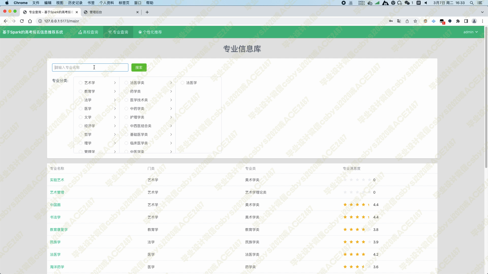
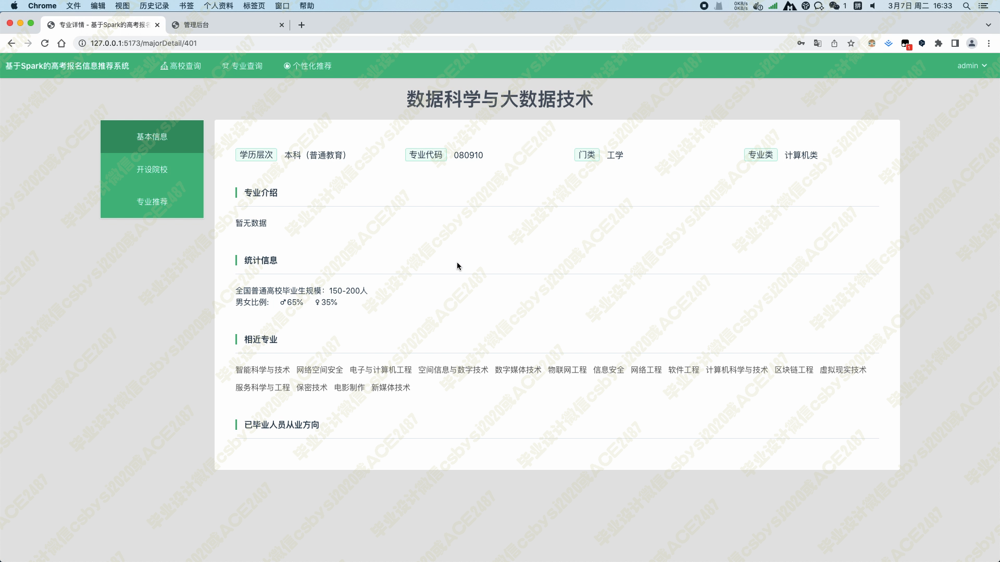

# 033 基于Spark的高考报名信息推荐系统-设计展示

> **代码有偿获取 可接受定制 微信联系方式: csbysj2020 或 ACE2487，备注(BS)**

## 介绍

该系统是基于Spark开发的高考报名信息推荐系统，结合了协同过滤算法和个性化推荐技术，旨在为用户提供个性化、多样化的高校及专业推荐服务。

用户可以通过登陆注册后进入系统，查找和筛选自己喜欢的高校及专业信息，同时也能够获得基于用户填写的高考志愿意向数据以及用户历史浏览、评分等数据的协同过滤推荐算法推荐的与其兴趣相关的优质高校及专业信息。

此外，系统还支持高校信息查询、专业信息查询、个性化推荐高校和专业等功能，方便用户快速找到自己喜欢的高校及专业信息，提高信息传递和分享的效率。

管理员还可以在后台管理所有抓取到的高校及专业数据，以及用户填写的高考志愿意向数据，为用户提供更加丰富的高校及专业资源。

总之，该系统能够为用户提供个性化、多样化的高校及专业推荐服务，帮助用户快速找到自己心仪的高校及专业，实现更好的教育资源共享和传递。

## 技术栈

python pyspark hadoop django scrapy vue element-plus 协同过滤算法
通过scrapy爬虫框架抓取“阳光高考”网站上的大学数据(包括了学校名称、学校logo、简介、满意度、院系设置、录取规则、食宿条件、设立专业等字段)以及大学的专业(包括了学历层次、专业代码、所属门类、专业类别、介绍、相近专业、从业方向、统计了毕业生规模以及男女比例等信息)数据
前台用户通过登陆注册后进入系统
管理员可在后台管理所有抓取到的大学及大学专业数据，以及用户填写的高考志愿意向数据
高校信息查询模块，用户可以根据高校名称关键词、高校所在地、学历层次等信息筛选出符合条件的国内高校，该页面以卡片形式展示了高校信息，其中包括了高校名称、高校LOGO、所在地、学历层次、主管部门以及高校评分等数据，分页组件以20条数据为一页，可大大降低后端压力
专业信息查询模块，用户可以根据专业分类以及关键词等信息筛选出符合条件的大学专业数据，该页面以表格形式展示了专业信息，其中包括专业名称、专业所属门类、专业所属类以及专业满意度等信息
个性化推荐高校和专业模块，这是根据用户在高考志愿填报模块所填写的预测成绩、喜欢的专业、喜欢的学校以及想去的省份所在地等信息，在数据库中查找出符合用户条件的高校以及专业数据，再个性化地推荐给用户；需要注意的是，当用户第一次访问该模块时，系统会检测用户是否已填写志愿，如果没有，必须填写后才能够推荐
当用户查看某高校详情时，可以看到该高校的多种信息，比如院校简介、学校领导、周边环境、通讯地址、院校设置、重点实验室、重点学科、师资力量、录取条件、食宿条件等，还可以查看该学校设立的所有专业数据，同时系统会依据基于物品的协同过滤算法给用户推荐相似的高校数据
当用户查看某专业的详情时，可以看到该专业的多种信息，比如学历层次、专业代码、所属门类，专业分类、专业介绍、统计信息包括该专业的毕业生规模和男女比例、相似专业、毕业后的从业方向。也可以看到该专业有哪些高校设立，同时系统会依据基于物品的协同过滤算法给用户推荐相似的专业数据

## 视频

> **点击查看 \>\>\> [https://www.bilibili.com/video/BV1p24y1N7b3/](https://www.bilibili.com/video/BV1p24y1N7b3/)**

## 截图

